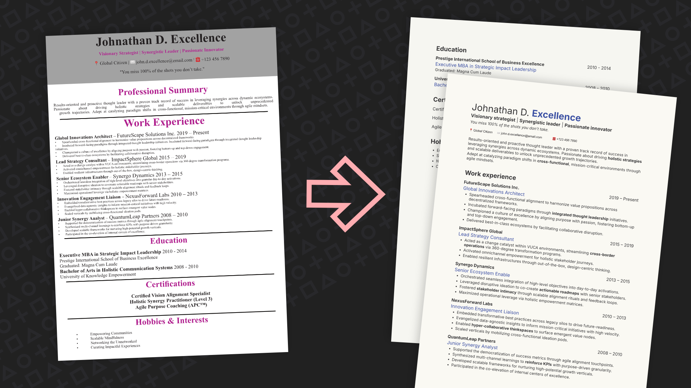
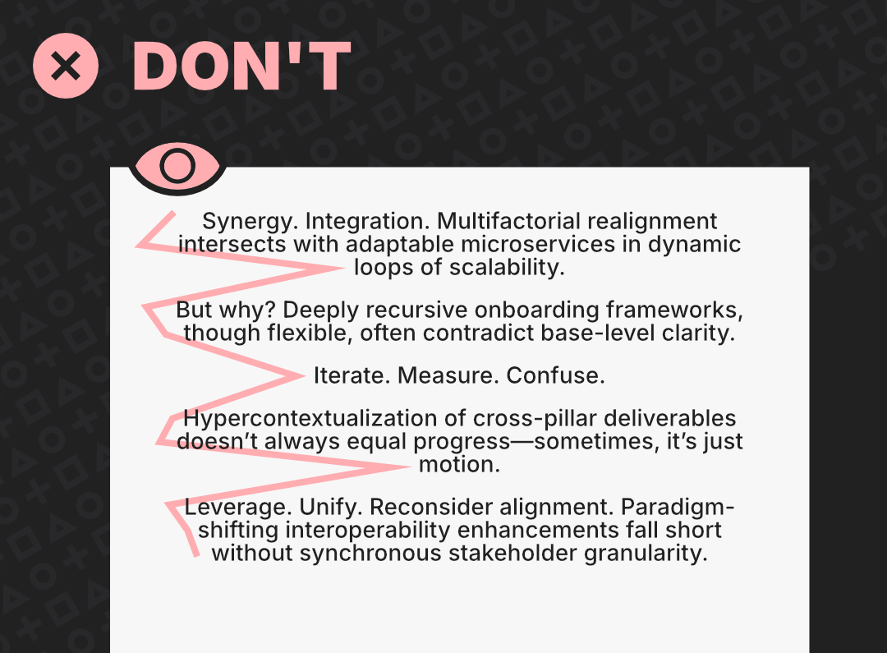
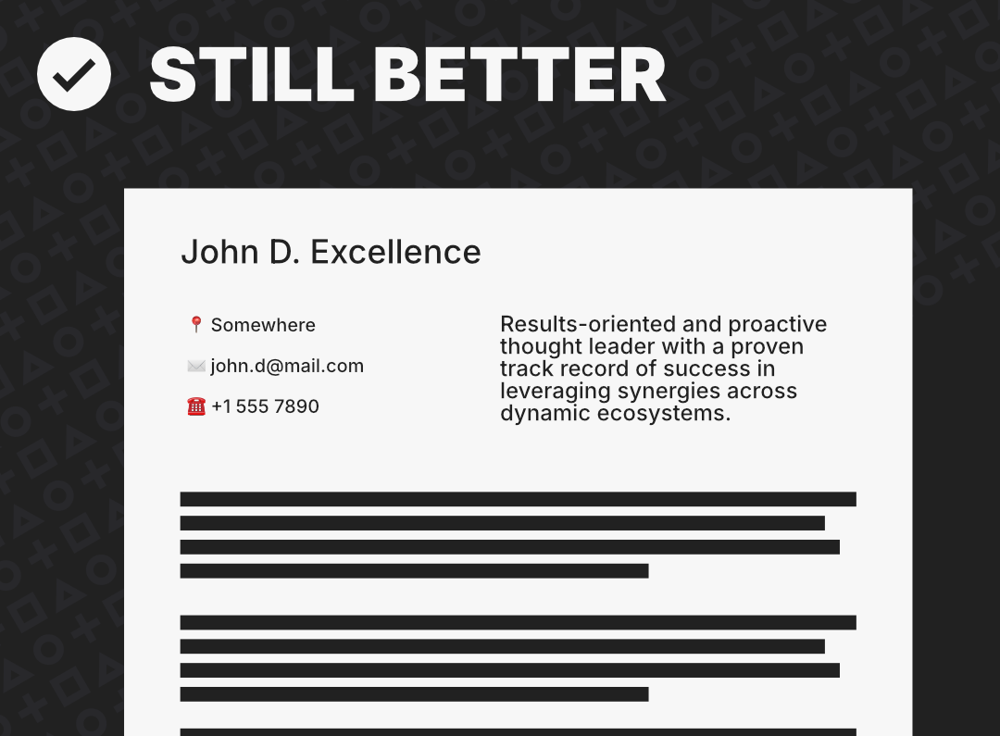

# Your CV looks like sh*t - Easy fixes for typographic redemption
A practical and opinionated guide to CV typography and layout for developers, helping your resume survive human eyes.

> [!NOTE]
> Shoutout to the [FullRemote community](https://fullremote.it), where the idea for this guide took form, and to Guido Penta's [Galactic CV Guide for Developers](https://github.com/GuidoPenta/galactic-CV-guide-for-developers) for serving as general inspiration.

### Index
- [Introduction](#dear-job-hunting-developers-and-other-non-designers)
- [The rhythm of alignment](#jump-in-the-line-or-the-rhythm-of-alignment)
  - [Justification](#unsolicited-justification-is-a-clear-admission)
  - [Hyphens](#leave-hyphens-to-the-typesetters)
  - [Left-alignment](#left-align-everything)
  - [Other horizontal alignment](#same-stuff-same-x)
  - [A common objection](#but-i-can-read-my-cv-just-fine)
- [Fear of the void](#to-fear-and-to-embrace-the-void-all-the-way-to-the-dreaded-second-page)
  - [Margins](#dont-mess-with-a-documents-margin)
  - [Separators](#divide-responsibly)
  - [Orphans and widows](#no-orphans-nor-widows)
  - [Page #2](#to-boldly-go-where-no-one-has-gone-before-page-2)
- [Dangerous styling](#size-weight-color-and-otherwise-questionable-classifiers-outside-typography)
  - [Typefaces and fonts](#typefaces-and-fonts)
  - [Sizes and weights](#on-sizes-and-weights)
  - [Bold](#bold)
  - [Color](#color)
- [The part where you DM me](#the-part-where-you-dm-me)

---
## Dear job-hunting developers and other non-designers,
Unbelievable as it may sound, out of 100 CVs you submit, 2 or 3 of them slip past an ATS and land in front of a pair of real, human eyes - if only for a fraction of a minute. That's when **your carefully crafted professional profile must measure against** the outdated multimodal biological intelligence running most **HR brains**.
And that worries me, because **I have seen many of your LaTeX creations and template customizations**. While they might have given you the necessary push over Greenhouse and Workday fences, **their lack of presentational elegance could now be your undoing**.

*Starting from a template doesn't necessarily save you from disaster*

### Vibing right in the age of vibe-recruiting
Remember in-person interviews? Content has always been king, but like it or not, your _style_ (or _vibe_) was a factor.
I’m not talking about grooming, clothing, and cologne. Some of my best friends are back-end developers, so I know the bar's height. What I’m talking about is your _voice_ (your tone, cadence, volume), which conveyed your thoughts more clearly and made your answers more memorable.

Making it all the way to an interview feels a bit ambitious in today’s job market. The vibes are checked much earlier—and often with a kind of passive detachment. Speculating further about what recruiters actually do at this stage might get us in trouble.
Let’s just say that **if you want to motivate someone** who’s got a thousand suitors for a single (real or fake) vacancy **to actually read your CV** rather than just look at it, **the bare minimum is to make it readable**.

*Recruiters screening your CV will appreciate your efforts*

### Sharing hard rules and opinions
That’s what I’ll do, if you’ll let me: **give you some basic typographic and design tips that will make your résumé shine** amongst the sea of samey *Awesome-CV* forks inundating the recruiter’s inbox (I promise a dedicated rant on the *Awesome-CV* template hyperinflation at a later date). No one expects you to start pumping out breathtaking custom designs, but elevating a serviceable template to typographic decency is a desirable, achievable feat for anyone.

Many of these tips are **hard rules you should follow**. While I'm not the ultimate authority on the topic—typography hasn’t been my hyperfixation since my London College of Printing days—ignoring most of what I’m about to tell you requires either a typographic superstar who knows exactly what they’re doing, or a berserker. I’ll assume you’re neither.
Some tips will fall under “just my opinions”: I'll politely welcome and smugly dismiss differing points of view. (Really just kidding: **I’m out here for constructive confrontations. Please share with me any take you have!**)

---
# Jump in the line, or: The rhythm of alignment
It’s hard to pick which principle deserves the number one spot, so I’ll start with the one that pushed me over the I-need-to-write-a-guide-about-this edge:
## Unsolicited justification is a clear admission
Like everything else I’ll beg you to avoid, justification has its place. This one’s is in long-form print. Combined with hyphenation, it can save a bit of paper across an entire book, create tidy blocky full-width paragraphs, or draw straight lateral borders clearly signaling a columnar layout.
You’re not writing descriptive essays for your work experiences, nor newspaper op-eds for your professional summary—and if you are, you definitely shouldn’t.

In our case, justified alignment (especially without manual hyphenation and with large fonts) forces your editor to **wildly vary letter-spacing across lines, disrupting the natural rhythm we follow to scan text**. You don’t want to throw your recruiter off their groove in the one brief dance they’ve granted you.

*Justification creates disproportionate, inconsistent spacing between words*

On that matter:
## Leave hyphens to the typesetters
**Turn hyphenation off**. Again, we’re not trying to cut down from 400 to 396 pages. We’re trying to present **crisp, discoverable keywords** and nuggets of information. Sawing them in half and scattering their remains across the opposite sides of the page does not serve the purpose.
If you’ve worked as a _Data Analyst_ and the line doesn’t have room for the last three letters, you might actually stop a recruiter in their tracks to *some* effect. In every other case, two distant halves of a keyword won't make a whole one to a skimming eye.

*Hyphenation will, at best, turn javascript into java*

But most importantly:
## Left-align everything
Reading (especially a recruiter’s gist-reading) is a dance. It’s not just about rhythm, but take that away and onlookers will squint their eyes or look away.
I know what you're thinking: no harm done in centering your name—and your contact info, while you're at it. But that's just your gateway drug to centering section titles and who-knows-what-else. I wish I could trust you with this, but I’ve seen good friends center-align entire paragraphs, and I don’t want your family to go through that.

**Your reader’s eyes move like a typewriter**: at the end of each line, they want to snap reliably to the same x-coordinate for the next. Otherwise, you’ll mess up their groove.

*Centered text creates an erratic path for your eyes to figure out*

*Left-alignment is the natural course for western readers*

This x-axis principle is good for almost everything, and that’s why you should:
## Same stuff, same x
This generalization of the left-alignment principle starts with an exception: **your contact info**. Those are short strings that would leave a whole lot of emptiness if stacked vertically. You definitely _can_ horizontally align them in a two-column layout, but you’re otherwise excused.

*If you can stop at that, your contact info could be centered*

*You can still align everything to the left, if you are willing to play around with your layout*

For everything else: **if it’s on the same hierarchy level, it should sit at the same distance from the left margin**.
The one remaining troublemaker will be your **employment dates**, which I’m guessing you’ve placed on the same line as your job title or employer. Depending on your layout, they’ll often look cleaner either left-aligned as far right as they can go or properly separated using a right-aligned tab stop (or `Shift+Tab`).

*Shift+Tab will push any remaining text to the right. Dates won't be perfectly aligned, but "good enough" can be acceptable in this case*

*Don't differentiate dates with styling only. They will be hard to pin down*

*If vertical real estate is not scarce, you can reserve an entire line for employment dates*

## But I can read my CV just fine!
I'm sure **you’re having none of these issues** while reading your own centered, justified, hyphenated, Comic Sans, Liquid Glass content.
Wanna know why? Because you know it intimately, you’ve written it, you’ve read it 100 times. Here’s a shocker: **you’re not really reading anymore**. Your brain is just filling in the gaps while your eyes bounce around (which is why proofreaders and writers are separate entities).
And there's so much more you might be missing.

---
# To fear and to embrace the void (all the way to the dreaded second page)
Negative space cuts both ways. Too little, and everything collapses in on itself; too much, and everything disperses.
You’ve already spent hours **wrangling ChatGPT to cram your entire career onto a single page**. And now here I come, asking you to make even more room for some emptiness?
Fear not: **you won't have to sacrifice any more content**.
## Don't mess with a document's margin
You’re likely starting your CV from a template in Word, Docs, Pages, or Canva. Notice how every text element keeps a respectful distance from the page’s edges (with only occasional decorations daring to venture further).
### If you gaze long enough into an abyss...
It looks like wasted real estate. Stare at it long enough, and it will call to you. The voices of a thousand influencers warning that **a two-page CV is toilet paper** will echo through that white space as you debate which bullet point to cut. You’ll feel tempted to nudge your name higher or let your main text box claim some lateral territory. Just **don't**.
### Mind the gap
When text hugs the edges, readers feel the anxiety of walking alongside a cliff. How close is too close? If you’re asking, you’re already planning to get too close. Avoid the debate and **let the default margins stand for now**.

If you’re doing LaTeX shenanigans, it’s up to you to set boundaries. Try roleplaying as a UX designer: print your document and **see if you can hold it comfortably without your thumbs covering any text**, and check if there’s **room to jot notes around the edges** with a marker.
That’s probably what those still-printing-in-2025 recruiters are doing anyway, so you’d better accommodate them.

*Leave enough room around for a human to interact with your CV*

*Respect margins, lest you fall off the edge of the world*

## Divide responsibly
**You’ve got sections**: Education, Work Experience, maybe a Professional Summary, Skills, Languages, Personal Interests... Someone should probably stop you before you start listing middle school grades and favorite pets, but I promised not to meddle with content affairs.

Even the most minimalist applicant must decide **how to separate sections**. Properly styled titles help (more on that later), but outside text I count the following three available tools: **spacing**, **dividers**, and **background shading**.
I'm telling you now: **you can only have two, and spacing is non-negotiable**.

*Separation by spacing is—dare I say—very demure*

*Dividers are basic, which can be both effective and harsh*

*Colored-in boxes require a great attention to contrast, harmony, and spacing again*

### Spacing plus one
To borrow a design cliché: _less is more_. "Less" prevents the claustrophobia we're trying to avoid with the mandatory spacing, and it also means "less stuff to maintain". Manually adjusting a bunch of dividers every time you tweak a bullet point stops being fun extremely fast. A row of underscores just replaces that issue with an unsightly hack.

So: spacing, plus maybe one between dividers and background shading.
Just remember that most **dividers recall the last century** in a non-flattering way, and **background shading introduces a plethora of** contrast, harmony, and spacing **issues** that no one wants to get into.

*Don't use all separation devices simultaneously*

### Urban planning for your CV
Uniform spacing is lazy spacing.
**Visual distance communicates hierarchy and correlation**. If everything is spaced the same, nothing is grouped nor distinct.
Think of your layout like a city map. Bullet points are suburban houses, part of the same block, lined up along narrow streets. Each work experience is a new block, separated by a wider two-way road. Sections are like districts: you'll find a four-lane highway between them.

Once you’ve defined those spacings, uphold **consistency**. It'll serve as a compass to navigate your content without getting lost.

*You can let spacing alone do your infrastructure heavy lifting*

## No orphans nor widows
### Explaining an unfortunate metaphor
I’m skipping witty remarks about familial deaths here.
"Orphans" and "widows" are (disproportionately unpleasant) typographic concepts referring to lonely words, breaking the flow of their otherwise cohesive body of text. More specifically:
- An **orphan** is the last word of a sentence stranded alone on a new line.
- A **widow** is the last line of a paragraph left dangling at the top of a new page or column.
**Both are bad**. White space should signal section breaks, and that's what orphans and widows look like. Additionally, when a reader's eyes hop to a new line in the middle of a sentence, their momentum expects a worthy continuation, not an abrupt end. They'll stumble reading it and it won't feel great.
### How to fix it
Without going through all seven stages of grief, I'll reassure you: orphans and widows happen, but they're fixable.

**Orphans** are easier. Find a **shorter synonym or abbreviation for a word** in the sentence, and the straggler should pop back up.

*Find shorter synonyms or get rid of unnecessary adverbs and adjectives*

If you've already reached maximum possible conciseness, you might **cheat a bit by shaving just a few pixels off the lateral margins** until that single orphan shifts back, now dangling just a hair over the ideal limits. This is **extremely dangerous**, as any number of lines in the document could be affected, creating more orphans than it fixes.

*Push the lateral margins just a tiny bit, but be ready to deal with the consequences*

More safely, you can **just embrace that additional line**. In this case, expand that sentence by two or three words at least. Give that single word a bit of company. Revel in freedom of expression, unshackled by the harsh telegrammatic bullet point limitations of modern CVs.

*Might as well put that new line to use*

The last resort—if you still feel like cheating while respecting the margin's sanctity—is **adding a line break (`Shift+Enter`) before the orphan**. You now have a two-word line, and since your text isn't justified, no one will notice this premature break.

*Add a line break without the spacing of a new paragraph*

**Widows** are trickier (this nomenclature only gets more awkward). CVs are usually so tightly packed and carefully worded that **you might need to drop an entire bullet point** to fix one.
That might be too big a sacrifice. So **here’s your official pass to shave a bit off the bottom margin** to pull that lonely line back where it belongs. Yes, margins remain sacred, but if you've read all the way here, you've earned this.

*User discretion is advised*

## To boldly go where no one has gone before (page #2)
You've **worked hard to squeeze your experience**, skills, and more into one tight page, because you've been told that most recruiters are Gen-Zers whose reels-fried brains would short-circuit at the sight of a page break.
**Did you really have to?**
### The case for breathing room
First of all, TikTok is all about scrolling, so their muscle memory would be on our side.
Secondly, **UX design is all about the severe limits of human cognition** (doomscrollers or not)—limits that are better served by a properly spaced document, especially if the tradeoff is just one measly input.
_Brevity is the soul of wit_, as an English guy once said (and what does that say about me writing this wall of text?). But brevity is about content, not strictly form. I could fit *The Philosopher's Stone* on a flyer, but you wouldn't enjoy reading it.

*Congrats! You managed to respect an arbitrary limit, and it only cost readability*

Clear sections, skimmable dates, and skill lists that don’t require eye gymnastics do a far better job than a one-size-fits-all layout at **making your CV accessible to overworked, distracted, much too human recruiters**.

*Clarity, structure, readability, and just a flick of the wrist*

---
# Size, weight, color, and otherwise questionable classifiers outside typography
### Allow me to nerd out
A premise (due or not, I never miss a chance to get into this tirade): _font_ does not mean what you think it means. You're thinking of _typeface_.
In front-end terms: a typeface is a font-family; **a font is a particular permutation of properties** (size, weight, and style) for that family. Typeface: Inter. Font: Inter, bold, 12px.
Yes, I am fun at parties.

*The many fonts of the Inter typeface*

*More or less recommendable typefaces. Can you guess them all?*

The following properties can be combined to concoct distinct styles. **You don't need more than three or four styles in your CV**, and even that might be a generous amount.
## Typefaces and fonts
### Strict limits on your playground
Most applicants have to accept a hard cap of **just one typeface**.

*Pick one typeface and style it out*

Bold adventurers might decide that their name and section titles are worthy of a display typeface. Alternatively, if you're equipped with taste, one for section titles and one for the rest. That's really it.

*If you're sure that's a complimentary, tasteful pairing, go ahead*

Use a third font-family in your CV, and you will be referred to a physician.

*Anything over two typefaces is criminal behavior*

_One typeface_ doesn't mean _one font_, but we'd do well to **go easy** here too. Modern tools offer a dangerously vast choice of weights: you'll do well to **limit yourself to just a couple**—something around `Regular` and `Bold`.
### The best possible typeface for your CV is...
Sorry, I baited you. Sure, I think some typefaces are _objectively_ bad (both universally and for our context), but that's still my opinion dressed up as fact. I can dig up the 2,000 words I wrote about Comic Sans being better than Helvetica, if you want to test this claim.

That's the thing with typefaces: **they surely create a vibe, but that vibe resonates differently** depending on taste, exposure, and all sorts of personal baggage.
Sans-serifs generally feel clean and modern; serifs often classy and traditional. Then again, while you might appreciate *Montserrat*'s simplicity and balance, I'd rather throw myself out a window if I see it again. You might find a *Times New Roman* mono-font résumé mature and confident; I might wonder if I've been handed a subpoena.

*Do you see the boldness and sleekness of Arvo, or only its heaviness and age?*

*Do you feel clean friendliness in Nunito, or just Comic Sans in smart-casual clothing?*

Taste is irremediably subjective, and unfortunately you must not please your own, but that of a stranger. If you need a hard rule, here's the only one I can confidently give: **don't use Wingdings**.

*Part of me wants you to try and at least get past an ATS with this*

## On sizes and weights
### No messing around
**Leave that default size be**. Maybe drop it by a point or two, depending on the typeface's base appearance and your content density.
Up next are job titles or company names—your choice, as long as this **hierarchy is reflected by a bigger size and/or a heavier weight**. Just avoid dramatic deltas.
Finally, section titles. With good enough spacing, you don't even need these to be much bigger than the job titles, if at all. With *stellar* spacing and structure, groupings would be so self-evident that section titles could even be redundant.

*Size is strictly related to hierarchy, but you might play with it to drive focus where you prefer*

Above all, **consistency**. The style for company names under your Work Experience should match that of academic institutions under Education, as they are hierarchically the same.

*Inconsistent sizing isn't dynamic, at least not in a good way*

## Bold
### To bold or not to bold...
Should you highlight keywords in bold? Few do, which vexes me. Although, if I were to indulge in overthinking (which I love), I'd concede it's a **double-edged sword**.
### The universal positives
It’s reasonable to assume an ATS has already scanned for relevant keywords. It’s just as likely that a recruiter will look for them, too, if only to get a sense of when and where each one applied.

*Quickly, I have 2 seconds to recall when you made stakeholders happy!*

**Bold words are a skimmer's landmark**, almost serving as faux-subtitles. If a recruiter takes 15 seconds to judge a CV, bolding's immense cognitive and time savings could make all the difference. You might even get a custom rejection email!
### The context-specific negative
Could such convenient and evident landing spots drive a recruiter to gist-read your CV even more gist-ly, thus **failing to absorb the context in between?** All we know is that they won't ever admit it.

/// same cv with no bolds vs few bolds

What's certain is that overthinking doesn't really help after a certain point. So just remember this: **When everything is bold, nothing is.**

*Avoid allowing the doubt that bold is your default style*

To give some real oomph to those bold words, pick just a couple **per experience** (not per line!), if not fewer. They will surely leave an impression.

*Bold words are the quickest way to tailor your universal CV to specific vacancies*

## Color
### The overthinker special
No one will tell you this (because it's another overthought), but: **manually set your page's background to white**, especially in LaTeX. It may export transparent, and while any viewer will default to a white render, the day your CV gets embedded in a dark-themed page will be its last.

*BThis is how Awesome-CV official GitHub repo appears in dark-mode*

### Making it pop, not explode
You're looking to add some flavor to your CV, and after staring at all that black text for so long, it’s starting to taste stale. **Do you actually need color?**
You're an adult, free to take any risk. Just, please:
- **Use a contrast checker**. If you need a reason for this, consider your color privileges revoked.
- **Get a friend's sanity check**. Some colors might contrast enough with your white background, while also offending common decency.
- **One (1) color** besides black. Again, it's about sustainable simplicity.
- Use it **sparingly**. Maybe your name (although I'd suggest only one of your first and last name). Maybe your section titles and/or job titles. Exercise absolute restraint after this.

*Just Google "contrast checker". Pro tip: APCA > WCAG*

*Acid, neon, or any other unprofessional feeling might not be what you're looking for*

*This is not the right time for color-coding*

*Color is accent or novelty: keep it so*

*Let color serve the same function as bold: a rare, thus meaningful, highlighter*

### Understated and sensible
**For some class and subtlety**, try this: don't _really_ use color.
Instead, **soften your white** background (I suggest erring in the direction of yellow-ish rather than gray). Optionally, you might also **tone down your black text**. Be mindful not to go full sepia.

*I might like this, but it could get us into printing troubles*

You now have a CV that is **slightly less harsh** on the recruiter's eyes than a standard `#00` on `#FF`. They may not explicitly notice, but their eyes will sigh in relief when opening your file.

*This is the next best available thing until we can do dark-mode CVs*

If it were up to me, I'd make all CVs dark-themed. Hell, I'd make them landscape. But rumor has it that they still print these things. If I ever manage to get a recruiter's reply, I'll let you know if that's true.

---
# The part where you DM me
I’ve already spilled 3,000 words on this, and I still have too much left to say. **Letter spacing? Line height? All caps sins? Ideal size-to-leading ratios?**
I could go on. Honestly, if I started covering every detail I think deserves attention, I’d end up writing a book. **I'm that detail-oriented and knowledgeable**. (😉 *wink wink, recruiters. Hit me up*).

While I clearly enjoy typing into the void, I do crave the occasional human interaction.  
**So let’s do this.** Reach out to me on [LinkedIn]([https://pages.github.com/](https://www.linkedin.com/in/simondiff/)) (/in/simondiff/).

**Job seekers**: If you need a quick look at your CV, let’s talk. I’ll point out the quick edits that’ll make it shine, and maybe we’ll even have a laugh. I promise I can keep it under 5 minutes if we’re chatting live (no such guarantees for written replies).

**Recruiters**: I’d love your feedback too. Or any sign that you actually exist, really. What catches your eye? What grinds your gears? Did I miss something, or get something very wrong?

Your CV deserves better. So does whoever has to read it.
